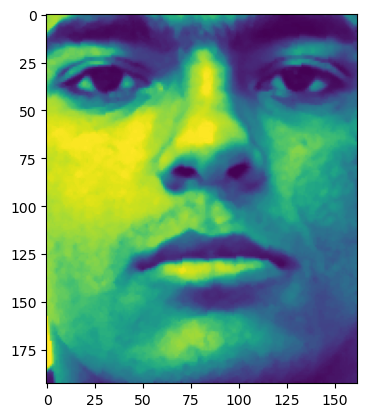

# Face Recognition Project



## Overview
This project implements a face recognition system using machine learning techniques. The goal is to detect and recognize faces in images or video streams with high accuracy. The core implementation is provided in the Jupyter Notebook [`FaceRecognition.ipynb`](https://github.com/Mehranalam/FaceRecognition/blob/main/FaceRecognition.ipynb).

## Features
- **Face Detection**: Identifies faces in images using pre-trained models.
- **Feature Extraction**: Extracts facial embeddings using deep learning models.
- **Face Recognition**: Matches detected faces against a known database.
- **Visualization**: Displays detected faces with labels.

## Requirements
To run this project, install the following dependencies:

```bash
pip install numpy pandas opencv-python dlib face-recognition matplotlib
```

## Usage
1. Clone the repository:
   ```bash
   git clone https://github.com/Mehranalam/FaceRecognition.git
   cd FaceRecognition
   ```
2. Open the Jupyter Notebook:
   ```bash
   jupyter notebook FaceRecognition.ipynb
   ```
3. Run the cells step by step to detect and recognize faces.

## Results
The notebook provides:
- Detected face bounding boxes
- Labeled recognized faces
- Evaluation of recognition accuracy

## Future Work
- Improve recognition accuracy with deep learning techniques.
- Extend to real-time face recognition from live video.
- Implement user-friendly interface for practical applications.

## Author
- **Mehran Alam**
- GitHub: [Mehranalam](https://github.com/Mehranalam)

## License
This project is open-source and available under the MIT License.

